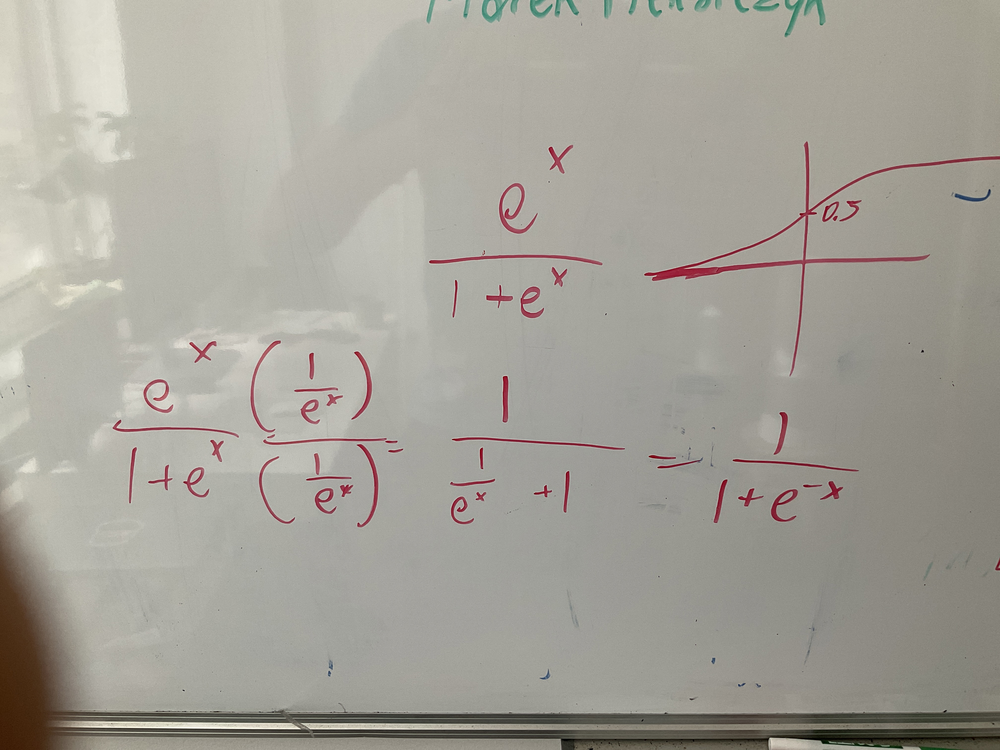
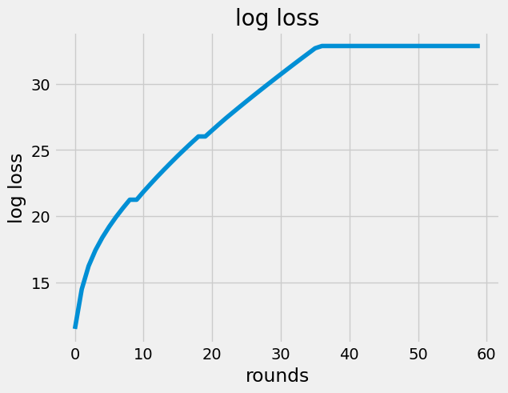
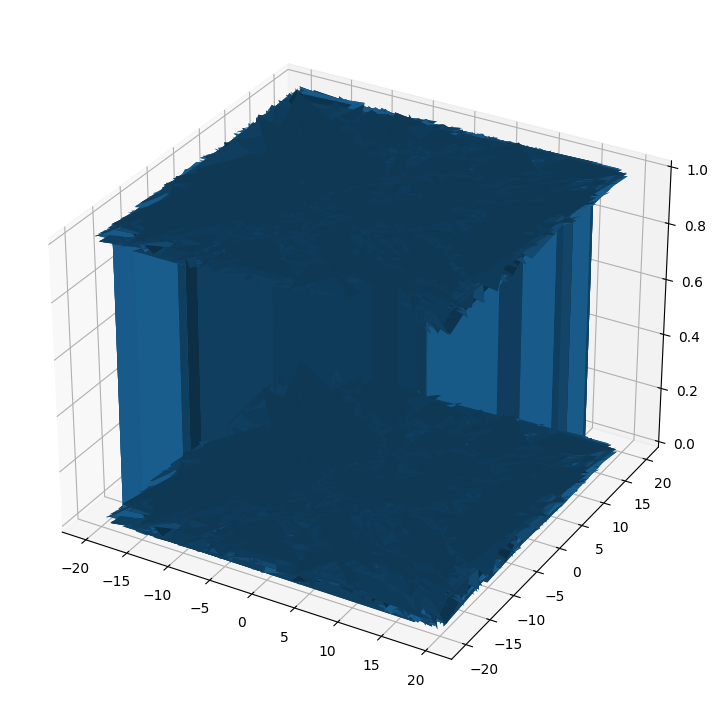
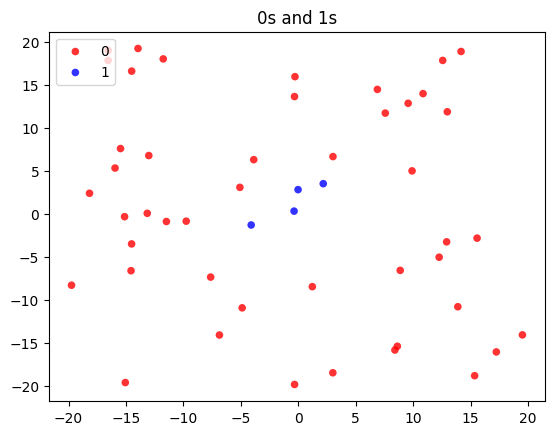
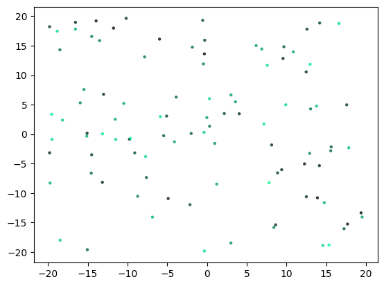

::: {#content}
-   [\[\[my back prop SGD from scratch 2022-Aug\]\]]{.tag}
    -   last issue, per my debugger now, I have a `y_prob` from the
        `feed_forward` which is a `nan`

    -   hmm so I had a bug , I was trying to prevent my func,
        `derivative_of_log_loss` from returning `inf` so I added instead
        of just

        ``` {.python data-lang="python"}
               def derivative_of_log_loss(y, y_prob):
                      result = -y / y_prob - (1 - y) / (1 - y_prob)
                      return result
        ```

        -   instead,

            ``` {.python data-lang="python"}
                       def derivative_of_log_loss(y, y_prob):
                              result = -y / y_prob - (1 - y) / (1 - y_prob)
                              if y_prob == 1:
                                  y_prob -= .00001
                              elif y_prob == 0:
                                  y_prob -= .00001
                          
                              return result
            ```

        -   oh yea oops got to flip the order of the update , so now
            changed to ,

            ``` {.python data-lang="python"}
                       def derivative_of_log_loss(y, y_prob):
                              if y_prob == 1:
                                  y_prob -= .00001
                              elif y_prob == 0:
                                  y_prob -= .00001
                              result = -y / y_prob - (1 - y) / (1 - y_prob)
                              return result
            ```

    -   hmm but still getting some wild output of `feed_forward` though,
        `y_prob` `nan` but this time I think a different reason. Seeing,

        ``` {.python data-lang="python"}
               y_prob = logit_to_prob(y_logit)
                  
                  ipdb> p y_logit, y_prob
                  (1065.1001995962283, nan)
        ```

        -   so I think I clearly have a bug since my `logit_to_prob`
            should return at most `1` . I mean I am using my own
            implementation of [sigmoid]{.tag} but maybe there is one
            already in `numpy` perhaps.
        -   hmm I know it is weird but maybe python cannot handle custom
            sigmoid limit? somehow?
        -   {width="50%"}
        -   ok I will switch to the more closed form then
        -   ok nice that has fixed the issue.

    -   13:38 ok next, let me see by any chance how does the log loss
        change across many examples then . hopefully improves?

    -   13:57 oh and I was wondering hey maybe I should vectorize the
        `feed_forward` func first, but ah actually it\'s already super
        fast , seems the `10,000` examples got processed in a second.

    -   14:11 ok I added a func to let me calc the total dataset loss
        for each round of the [\[\[Stochastic Gradient Descent
        SGD\]\]]{.tag}, so let me see what does the loss data look like
        after some time, given that I have only added learning to just
        one of the three layers of course!
        -   ok

            ``` {.python data-lang="python"}
                       import network as n
                          X, Y = n.build_dataset_inside_outside_circle()
                          layers = n.initialize_network_layers()
                          loss_vec, layers = n.train_network(X, Y, layers)
                          
                          from datetime import datetime
                          import pytz
                          def utc_now():
                              return datetime.utcnow().replace(tzinfo=pytz.UTC)
                          def utc_ts(dt):
                              return dt.strftime("%Y-%m-%dT%H%M%S")
                          
                          with plt.style.context('fivethirtyeight'):
                              plt.plot(loss_vec)
                              plt.xlabel("rounds")
                              plt.ylabel("log loss")
                              plt.title("log loss")
                              out_loc = f"{utc_ts(utc_now())}.png"
                              print("saving to", out_loc)
                              pylab.savefig(out_loc, bbox_inches='tight')
                              pylab.close()
                          
            ```

        -   actually wow kind of super confused because , the loss is
            increasing for some reason? haha very weird.

            \

        -   hmm since my dataset is basically a circle, maybe I can plot
            like the heatmap of the outputs for fun,

        -   14:53 ok so first plotting the input data, using this nice
            [surface-matplotlib]{.tag} code
            [here](https:www.geeksforgeeks.org/3d-surface-plotting-in-python-using-matplotlib/)
            from Geeks for Geeks,

            ``` {.python data-lang="python"}
                       import network as n
                          X, Y = n.build_dataset_inside_outside_circle()
                          layers = n.initialize_network_layers()
                          loss_vec, layers = n.train_network(X, Y, layers)
                          
                          Y_actual, total_loss = n.loss(layers, X, Y)
                          # Creating figure
                          fig = plt.figure(figsize =(14, 9))
                          ax = plt.axes(projection ='3d')
                          
                          x = X[:, 0]
                          y = X[:, 1]
                          z = np.reshape(Y, (10000, 1))
                          # Creating plot
                          ax.plot_surface(x, y, z)
                          out_loc = f"{n.utc_ts(n.utc_now())}-surface.png"
                          pylab.savefig(out_loc, bbox_inches='tight')
                          pylab.close()
            ```

            \

        -   ok but this is just my raw data and that is not supposed to
            look like this haha . weird maybe my dataset is corrupt.

        -   15:20 weird indeed but I don\'t think the data is wrong,
            since, spot checking looks good,

            ``` {.python data-lang="python"}
                       In [29]: list(zip(X[:10, :], Y[:10]))
                          Out[29]: 
                          [(array([12.57117303, 17.80803891]), 0),
                           (array([-15.47757827,   7.56940377]), 0),
                           (array([ 8.87153679, -6.58170276]), 0),
                           (array([3.01824581, 6.63723689]), 0),
                           (array([ 13.88668822, -10.80489459]), 0),
                           (array([-14.51213788,  -3.50732835]), 0),
                           (array([-15.05921078, -19.61333702]), 0),
                           (array([-14.56223177,  -6.62069552]), 0),
                           (array([-16.5538711 ,  17.80545795]), 0),
                           (array([ 15.35033881, -18.81698047]), 0)]
                          
                          In [30]: from collections import Counter
                          
                          In [31]: Counter(Y)
                          Out[31]: Counter({0: 9500, 1: 500})
                          
                          In [34]: eyes = [i for (i, y) in enumerate(Y) if y == 1][:10]
                              ...: list(zip(X[eyes, :], Y[eyes]))
                          Out[34]: 
                          [(array([-0.02210084,  2.79761956]), 1),
                           (array([-0.36863931,  0.30226094]), 1),
                           (array([-4.1019566 , -1.30833663]), 1),
                           (array([2.17125538, 3.49039422]), 1),
                           (array([0.32608483, 1.32609685]), 1),
                           (array([ 0.97367505, -1.58043239]), 1),
                           (array([-1.99563171,  0.10884151]), 1),
                           (array([ 1.77190771, -2.70986596]), 1),
                           (array([1.96456464, 2.57613211]), 1),
                           (array([-0.56243767, -2.84586904]), 1)]
            ```

        -   except yea maybe I should even out the 95%, 5% ratio there .
            Also I\'m pretty sure now this surface plot does not do very
            well with binary z axis values perhaps.

        -   16:09 also just a more flat way to just double check the
            dataset visually ,

            ``` {.python data-lang="python"}
                       import plot
                          plot.scatter_plot_groups(X[:50], Y[:50]
            ```

            \
            \

        -   Just would be nice to display the predicted outputs colors
            too

        -   16:29 ok found some cool [rgb-color]{.tag} code
            [here](https:stackoverflow.com/questions/56729710/how-to-generate-dark-shades-of-hex-color-codes-in-python#56730120)
            -   so starting off with this light gree,
                `r, g, b = (0, 253, 150)` , `#00FD96` ,
                

                and I am using [this cool
                site](https:colors-picker.com/hex-color-picker/) to see
                what does the color look like for some hex value , hex
                color picker rgb\

            -   I can use that code to darken this proportionally to the
                prediction,

                ``` {.python data-lang="python"}
                               def map_values_to_colors(Y):
                                  
                                      # base color is a light green
                                      r, g, b = 0, 253, 150
                                  
                                      colors = [
                                          darken_color(r, g, b, factor=y)
                                          for y in Y
                                      ]
                                      return colors
                                  
                                  plot.scatter_plot_by_z(X[:100], np.random.random(100))
                ```

                \

            -   16:55 however at this point actually I realized oops the
                loss I was plotting before yea really is pretty bad
                since , well,

                ``` {.python data-lang="python"}
                               In [67]: from collections import Counter
                                  
                                  In [68]: Counter(Y_actual)
                                  Out[68]: Counter({0.5: 10000})
                ```

                so yea maybe only tuning the last layer of a [\[\[neural
                net nn\]\]]{.tag} is not enough . really you need to
                tune all of them.\

            -   

            -   

            -   
:::
