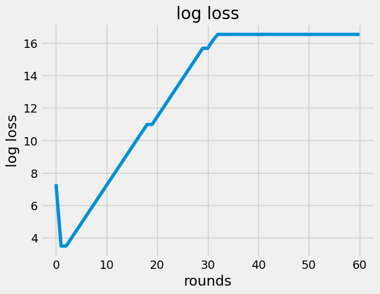
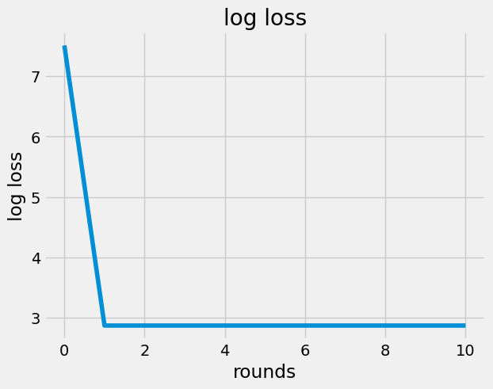
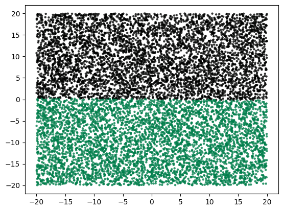
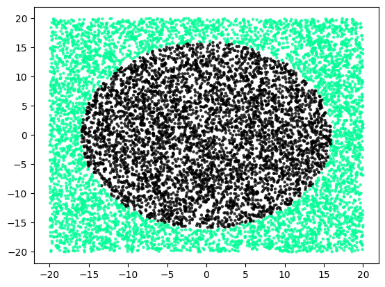
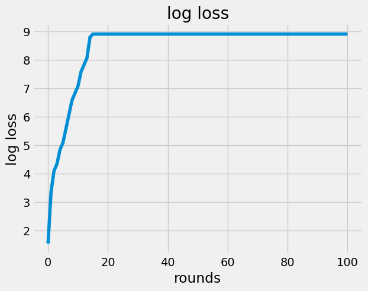
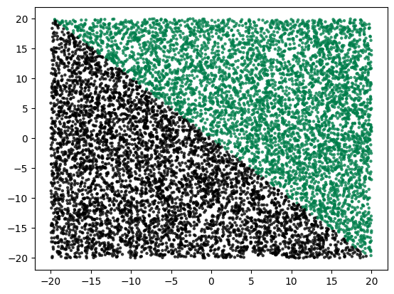
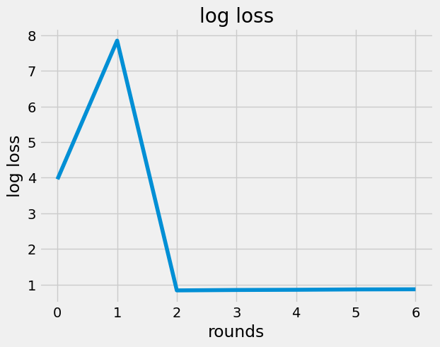
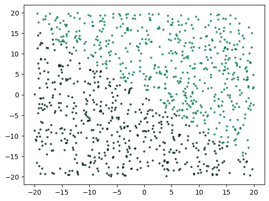

::: {#content}
-   [\[\[my back prop SGD from scratch 2022-Aug\]\]]{.tag}
    -   yayay
    -   12:38 so what happened last time? well let me look at the
        2022-08-21.html notes I created.
        -   13:20 darn so ok spent bunch of time figuring out why I
            couldnt view all the images in that html but basically
            combination of the html references images in log seq dir and
            also I have to copy them to my git repo area for this repo.
            Anyway,
        -   13:35 finally looking, so the weird issue was my log loss
            was getting worse with training when only affecting the
            final layer , so then I plotted the raw input data with a 3d
            surface plot but it was really weird looking and shapeless .
            I plotted this on a 2d plot instead and yea looked
            reasonable. But yea the 95% label=0 to to 5% label=1 maybe
            was contributing to why the 3d surface plot looked formless
            and uninteresting. And for fun I tweaked my 2d plotting code
            to use a spectrum of colors so I can perhaps look at my
            output data. But then oh wow oops I realized all the
            predictions were basically just 0.5 . So my main thought
            then was that haha probably training just the last layer of
            a network is basically not useful.
    -   13:44 ok so let me continue with a strategy to train the full
        network and not just the final layer ,
        -   look back at my network,

        -   **13:48** quick capture:
            {width="40%"}

        -   Just going to write up the partial derivative parts of the
            gradient one at a time,
            -   {width="40%"}
            -   {width="40%"}

        -   16:53 ok I have added this to the code now . let me try that
            train loop again then

            ``` {.python data-lang="python"}
                       import network as n
                          import plot
                          
                          X, Y = n.build_dataset_inside_outside_circle()
                          layers = n.initialize_network_layers()
                          loss_vec, layers = n.train_network(X, Y, layers)
                          
                          plot.plot_loss_vec(loss_vec)
            ```

            \
            \

        -   17:12 ok output above is pretty interesting. Probably if
            indeed things are working, the learning rate is too high.
            But haha in case something is actually working, let me
            actually try plotting the predictions for the loss after the
            first round which I think looks lowest.

            \

            ``` {.python data-lang="python"}
                       layers = n.initialize_network_layers()
                          loss_vec, layers, artifacts = n.train_network(X, Y, layers, log_loss_each_round=True, steps=10)
                          
                          layers = artifacts["9"]["model"]
                          Y_actual, total_loss = n.loss(layers, X, Y)
            ```

            \
            \
            \
            \

            ``` {.python data-lang="python"}
                       layers = artifacts["9"]["model"]
                          Y_actual, total_loss = n.loss(layers, X, Y)
                          plot.scatter_plot_by_z(X, Y_actual)
            ```

            \

        -   17:39 ok haha that\'s kind of confusing. Not sure why the
            second time around, pretty sure I did not re-generate the
            data, the loss on this training round went down and stayed
            down. Likely the first time around we must have jumped too
            far from the minimum irrecoverably. And the second time,
            since indeed the weights are generated randomly, we stayed
            close.

        -   But also for the second round, when plotting some outputs,
            clearly we see something funky is going on. And also I
            suspect that since I have not fixed that whole 95% to 5%
            dataset imbalance, some funkiness is happening and indeed
            the loss does appear to be small because the penalty on the
            imbalanced dataset is not shining through.

        -   17:47 So the imbalanced dataset is likely messing with
            learning and also with the perception of the loss as well.

        -   20:30 ok to balance out that data, probably simplest is to
            generate data where the circle is just bigger

        -   20:52 ok so I ended up with something like,

            \

            ``` {.python data-lang="python"}
                       # dataset.py
                          import math
                          import numpy as np
                          from collections import Counter
                          
                          def build_dataset_inside_outside_circle(balance=0.5):
                              # Create some data in a 20x20 box centered at origin.
                              num_samples = 10000
                              radius = math.sqrt(40*40*balance/math.pi)
                              X = np.random.random((num_samples, 2)) * 40 + -20
                              f = (lambda a: int(np.sqrt(a[0]**2 + a[1]**2) <= radius))
                              Y = np.array(list(map(f, X)))
                          
                              # Validate balance
                              assert abs(Counter(Y)[1]/num_samples - balance) < 0.02
                              return X, Y
            ```

            ``` {.python data-lang="python"}
                       import dataset
                          import plot
                          
                          X, Y = dataset.build_dataset_inside_outside_circle(0.5)
                          plot.scatter_plot_by_z(X, Y)  # saving to 2022-08-28T005137-scatter.png
            ```

            \
            \

        -   20:58 ok lets see what happens with training then ,

            \

            ``` {.python data-lang="python"}
                       
                          layers = n.initialize_network_layers()
                          loss_vec, layers, artifacts = n.train_network(X, Y, layers, log_loss_every_k_steps=10, steps=1000)
                           outer: 100%|███████████████████████████████████████████████| 1000/1000 [04:45<00:00,  3.51it/s]
                          
                          plot.plot_loss_vec(loss_vec)
                          # saving to 2022-08-28T012206.png
            ```

            \
            \

        -   21:20 ok so this time definitely a little more time to train
            since I\'ve been measuring log loss every 10 steps on all
            `10,000` samples but I can do fewer next time to iterate
            more quickly.
            -   Especially since darn, indeed this time, the loss
                spiraled out of control

            -   Out of curiosity, let me plot the outputs for basically
                the earliest model ,

                ``` {.python data-lang="python"}
                               
                                  layers = artifacts["10"]["model"]
                                  Y_actual, total_loss = n.loss(layers, X, Y)
                                  plot.scatter_plot_by_z(X, Y_actual) # saving to 2022-08-28T012619-scatter.png                                                          
                ```

                \

            -   ok wow pretty quirky.

        -   21:28 ok yea so super curious about what does reducing
            learning rate do then. Added some additional code to support
            this too.

            \

            ``` {.python data-lang="python"}
                       import network as n
                          model = n.initialize_model({"learning_rate": 0.01})
                          (
                              loss_vec, model, artifacts, X_validation, Y_validation, Y_prob
                          )  = n.train_network(X, Y, model)
                           outer: 100%|███████████████████████████████████████████████████| 60/60 [00:01<00:00, 31.19it/s]
                          
            ```

        -   21:49 ok lets look at a first run then ,

            ``` {.python data-lang="python"}
                       plot.plot_loss_vec(loss_vec)
                          # saving to 2022-08-28T015127.png
            ```

            \
            \

            ``` {.python data-lang="python"}
                       plot.scatter_plot_by_z(X_validation, Y_prob)  # saving to 2022-08-28T015518-scatter.png
            ```

            \

        -   21:56 darn okay still not learning, despite the additional
            balancing and lower learning rate. Super curious what is the
            fundamental issue in this network. Curious to debug this.

        -   
-   16:03 also I learned the plant in the office is called the swiss
    cheese plant
    -   [https://www.plantindex.com/swiss-cheese-plant/](https:www.plantindex.com/swiss-cheese-plant/)
    -   
-   hmm
:::
